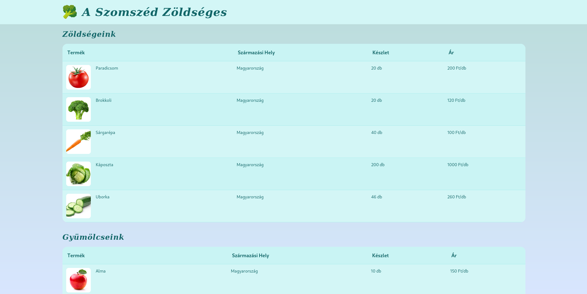

> A vulnerable webapp for demonstration purposes, built with Svelte. 

  


## Pre-requisites

```bash
pnpm install
cp .env.example .env
cp .env.example .env.production
# Edit .env and .env.production
```

## Development

```bash
pnpm run dev
```

## Building

```bash
pnpm run data:mkdir
pnpm run db:push
pnpm run check
pnpm run build
pnpm run db:init-data
pnpm start
```