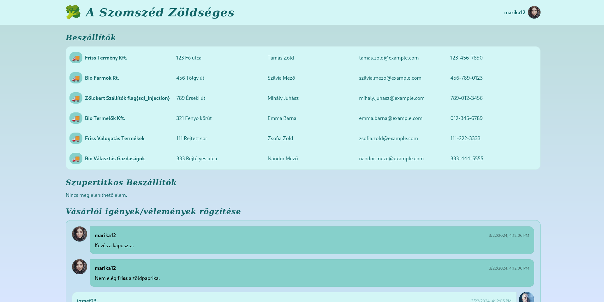

<h1 align="center">
  <br>
  
  <br>
  A Szomszéd Zöldséges
  <br>
</h1>

<h4 align="center">A vulnerable webapp for demonstration purposes, built with <a href="https://svelte.dev/" target="_blank">Svelte</a>.</h4>

<p align="center">
    
	
	
	

</p>


## Pre-requisites

```bash
pnpm install
cp .env.example .env
cp .env.example .env.production
# Edit .env and .env.production
```

## Development

```bash
pnpm run data:mkdir
pnpm run db:push
pnpm run check
pnpm run db:init-data
pnpm run dev
```

## Building

```bash
pnpm run data:mkdir
pnpm run db:push
pnpm run check
pnpm run build
pnpm run db:init-data
pnpm start
```